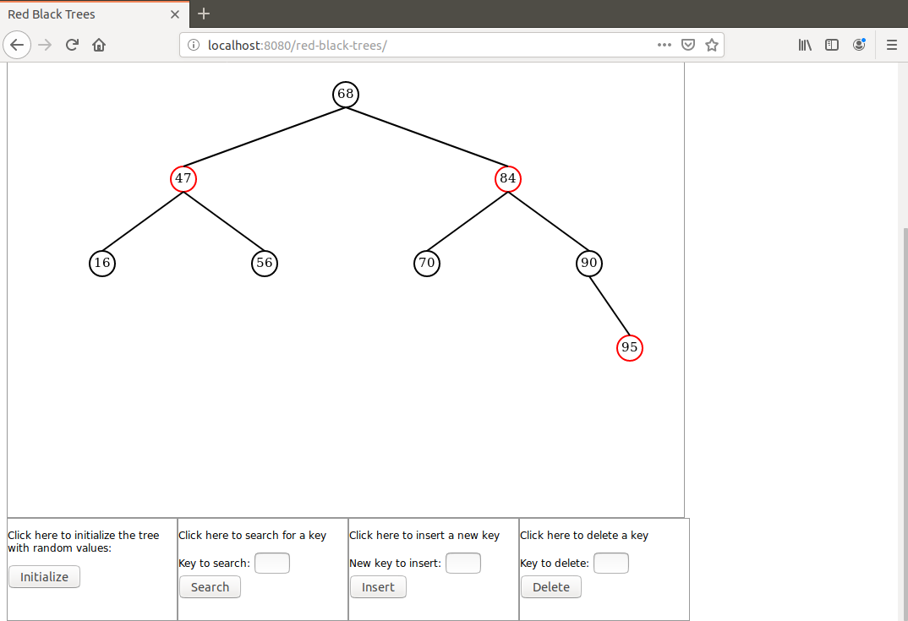

# red-black-trees-java-demo
Red Black Tree Java based demonstration on Canvas using AJAX for communication between browser and server

I present here a Java based demonstration of a Red Black Tree. The RBT itself is implemented in Java on server side and an RBT instance is attached as argument to the Http session.

The tree depth is limited to 4 to keep the display simple.

The RBT implementation closely follows Cormen's textbook except that I always favor the non-recursive implementation over the recursive one.

In addition I created two Junit classes to separately test the Tree class and the DisplayTree subclass used in the actual application.

I chose to make the Tree class generic.

To launch the demo run the command `mvn spring-boot:run` in project directory.

When the application has started open a browser and hit URL 'localhost:8080/red-black-trees'.

A screen shot of a possible initial display is shown on this image:

For a Java implementation of a basic Binary Search Tree please visit the repository:

https://github.com/dubersfeld/binary-search-trees-java-demo

Dominique Ubersfeld, Cachan, France 
